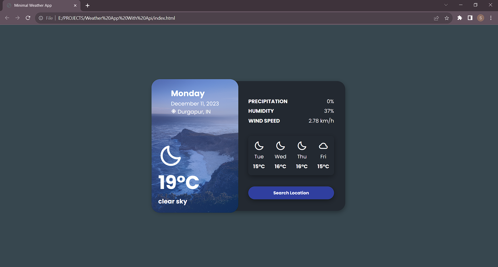

# Weather-App-using API
Minimal Weather App Ui Design that takes loacation input from user and shows current weather

I have used openweather api to connect this app to api to get weather info

# Screenshot
Here we have project screenshot :

